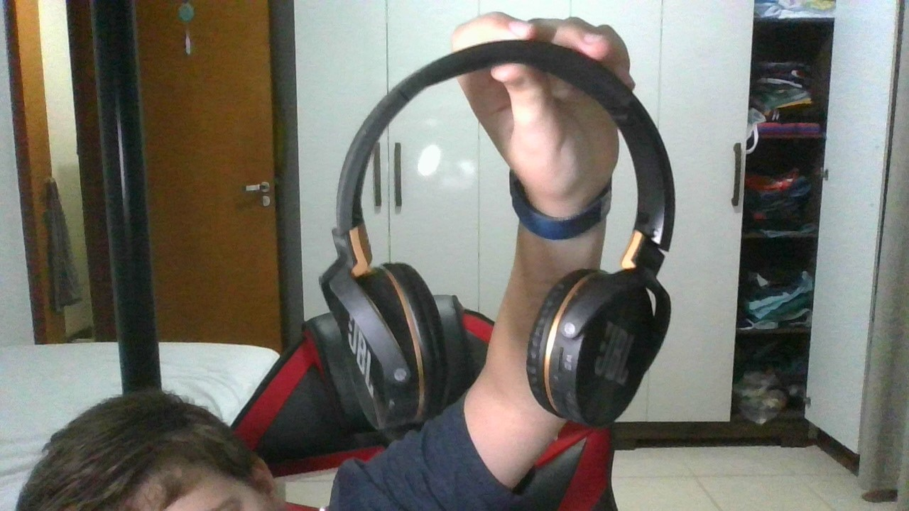
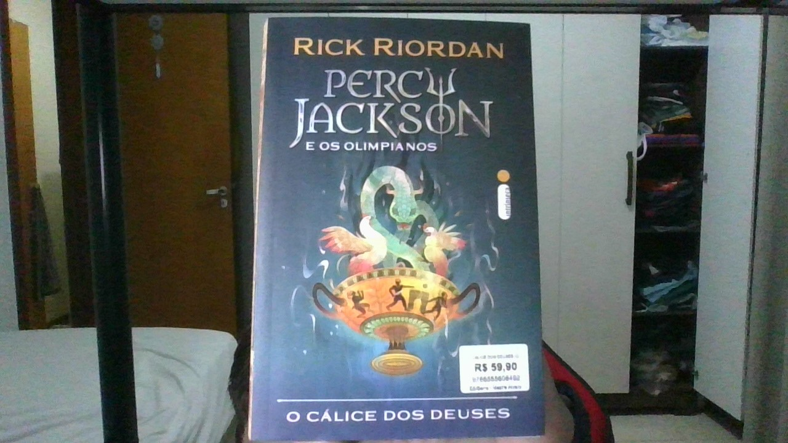
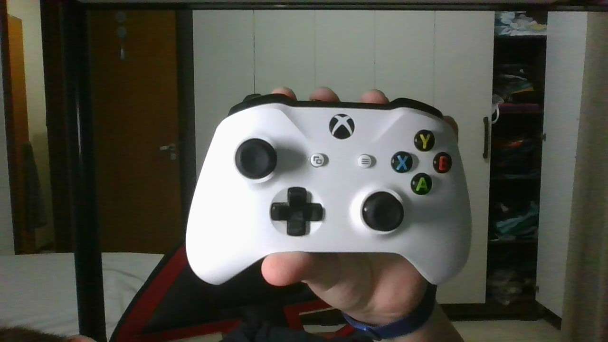

		

			<h4 style="text-align: center;font-family: 'Lexend Tera', sans-serif;">
				ESTUDO DE CASO ENTRE GOOGLE LENS E MOBILENET
				  
				GOOGEL LENS 
				

					<b style="color: rgb(255, 0, 4); font-size: 50px;">X</b>
				

				 
				
Mobilenet

			</h4>

			

			
			<ol style="padding:0px;">
		
				

					<li class="col-sm-4 col-xs-12">
						<b style="color: rgb(243, 214, 232);">Imagem Teste: </b>
					</li>
					<h5 class="col-sm-4 col-xs-12" >Resultado no <b>GOOGLE LENS</b>:
						fone de ouvido  
					</h5>
					<h5 class="col-sm-4 col-xs-12">Resultado no<b> Modelo Mobilenet</b>:
						microfone  
					</h5>

					

						<h4>Resultado:</h4>
						

						<h4>o google lens acertou.</h4> <h1>google lens: 1 / mobilenet: 0</h1>
					

				

				 

				

					<li class="col-sm-4 col-xs-12">
						<b style="color: rgb(243, 214, 232);">Imagem Teste: </b>
					</li>
					<h5 class="col-sm-4 col-xs-12" >Resultado no <b>GOOGLE LENS</b> -
						bastão de selfie  
					</h5>
					<h5 class="col-sm-4 col-xs-12">Resultado no <b>Modelo Mobilenet </b> -
						microfone  
					</h5>

					

						<h4>Resultado:</h4>
						

						<h4>google lens acertou</h4> <h1> google lens: 2 / mobilenet: 0</h1>
					

				

				
				 

				

					<li class="col-sm-4 col-xs-12">
						<b style="color: rgb(243, 214, 232);">Imagem Teste: </b>
					</li>
					<h5 class="col-sm-4 col-xs-12" >Resultado no <b>GOOGLE LENS</b> -
						necessaire  
					</h5>
					<h5 class="col-sm-4 col-xs-12">Resultado no <b>Modelo Mobilenet </b> -
						garrafa d'água  
					</h5>

					

						<h4>resultado:</h4>
						

						<h4>os dois erraram</h4> <h1>google lens: 2 / mobilenet: 0</h1>
					

				

				
				 

				

					<li class="col-sm-4 col-xs-12">
						<b style="color: rgb(243, 214, 232);">Imagem Teste: </b>
					</li>
					<h5 class="col-sm-4 col-xs-12" >Resultado no <b>GOOGLE LENS</b> -
						livro  
					</h5>
					<h5 class="col-sm-4 col-xs-12">Resultado no <b>Modelo Mobilenet </b> -
						livro  
					</h5>

					

						<h4>Resultado:</h4>
						

						<h4>Empate</h4> <h1>google lens: 2 / mobilenet: 0</h1>
					

				

				
				 

				

					<li class="col-sm-4 col-xs-12">
						<b style="color: rgb(243, 214, 232);">Imagem Teste: </b>
					</li>
					<h5 class="col-sm-4 col-xs-12" >Resultado no <b>GOOGLE LENS</b> -
						controle de videogame  
					</h5>
					<h5 class="col-sm-4 col-xs-12">Resultado no <b>Modelo Mobilenet </b> -
						joystick  
					</h5>

					

						<h4>Resultado:</h4>
						

						<h4>google lens acertou!</h4> <h1>google lens: 3 / mobilenet: 0</h1>
					

				

				
				 

			</ol>

			  

			<h4 class="col-xs-12 result">
				Foram testadas 5 imagens.
				 
	 			E, com o placar de 3/0, e surpreendendo um total de 0 pessoas, O google lens venceu. 
			</h4>

		

		  

    	

      		Desenvolvido por: Miguel Peruzzo
    	

